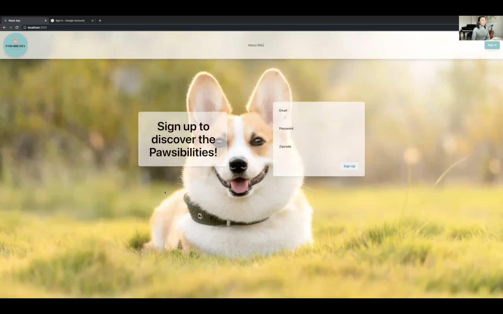
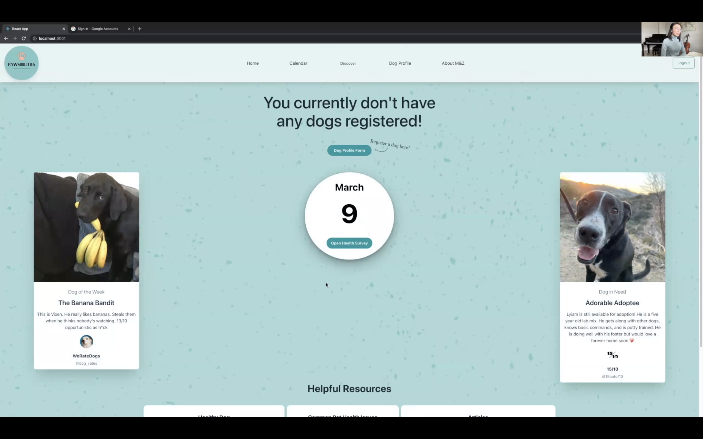
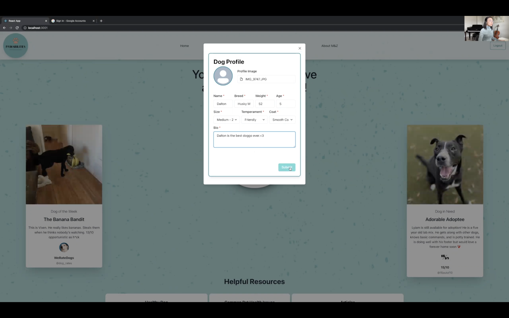
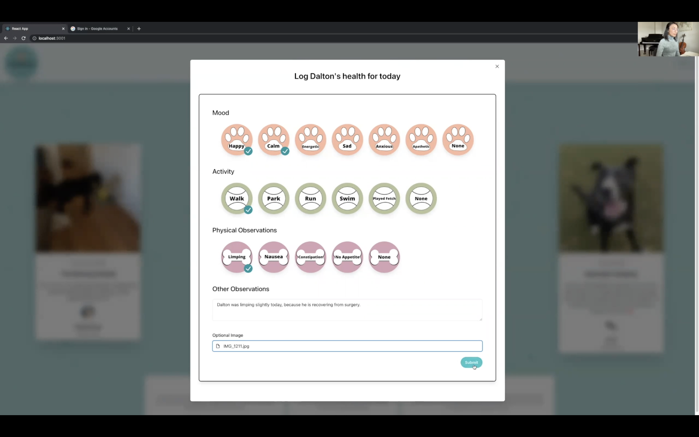
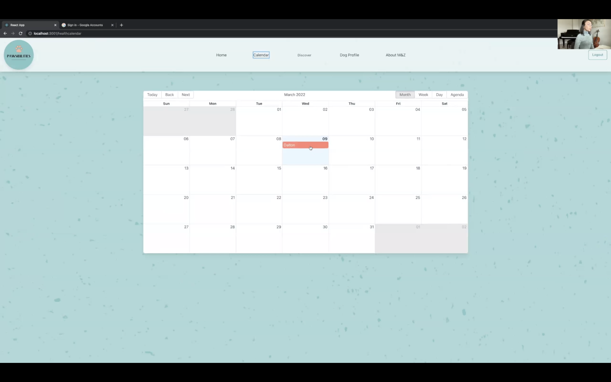
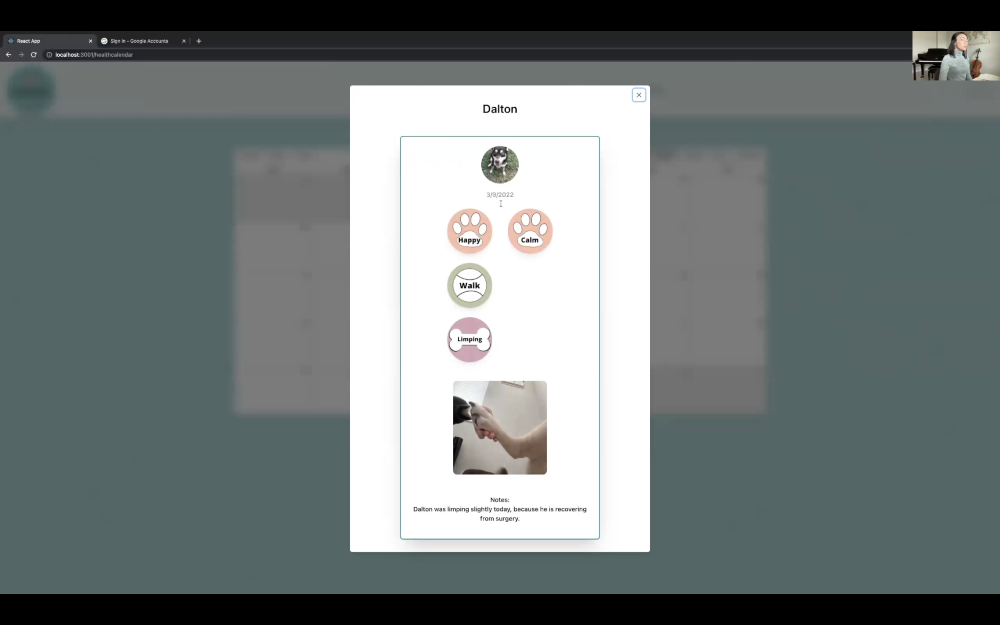
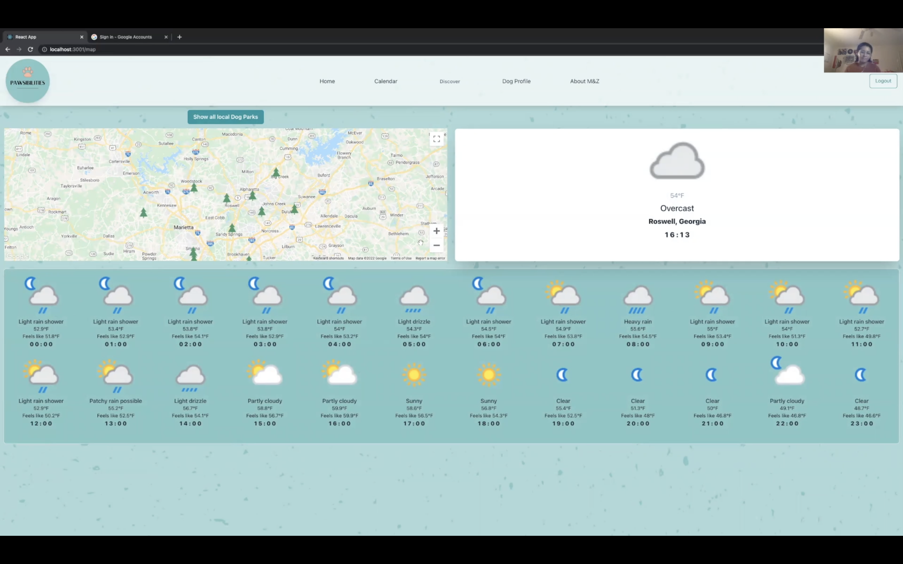
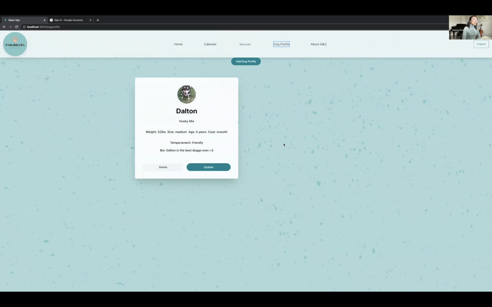
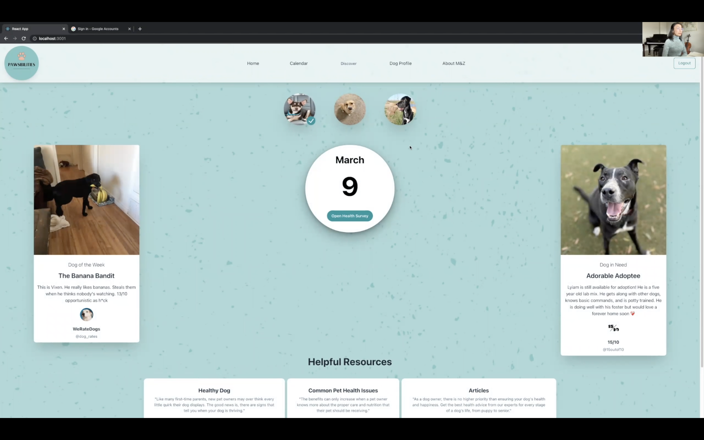
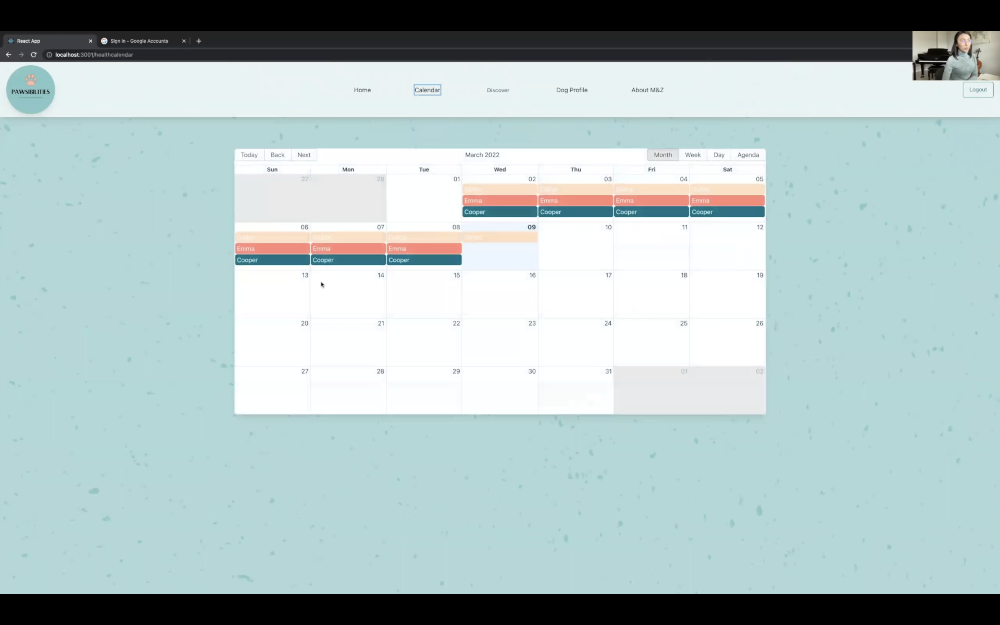

# Why Pawsibilities?
Having a pet is not a only a privilege, but a responsibility. It is our obligation to care for our pets to the absolute best of our abilities. How can you, a person with a non-stop, busy life filled with countless obligations, pawssibly keep track of yet another aspect of your life?

Do not fret! Pawsibilities is here to help. With this app you can track your pet's health daily. So, you can carry a clean conscience to your next vet visit knowing you have monitored your pets health to the best pawssible extent.
 

## Here is a preview of Pawsibilities!
 
 

### The user can sign up and sign in to discover the Pawsibilities! 

 
 

### Once they do that, they will be redirected to the home page where they will find The Banana Bandit, an Adorable Adoptee, and a few helpful resources down at the bottom, and an indicator they have not created any dog profiles yet!

 
 

### The user can click on the "Dog Profile Form" button and register a dog.

 
 

### Once a dog is registered, a health form can be submitted for that day! The user can select multiple icons, add notes, and include a picture in the health log.

 
 

### The health log that was submitted can be viewed in the "Calendar" page.

 
 

### The event can be selected so the user can see the details. 

 
 

### The "Discover" page uses the zipcode entered during sign up to show adoption centers, vets, and dog parks near the user. 

 
 

### The user can view all their registered dogs and add more in the "Dog Profile" page. 

 
 

### The last picture here, shows what the home page and calendar would look like for someone who has multiple dogs and has logged their health daily. 

 

 
 

# When we take on the responsibility of having a pet we make a promise to love them, provide for them, and care for them to the best of our abilities. Our promise with Pawsibilities is to help you keep yours.
 
 

# Getting Started with Create React App

This project was bootstrapped with [Create React App](https://github.com/facebook/create-react-app).

## Available Scripts

In the project directory, you can run:

### `npm start`

Runs the app in the development mode.\
Open [http://localhost:3000](http://localhost:3000) to view it in your browser.

The page will reload when you make changes.\
You may also see any lint errors in the console.

### `npm test`

Launches the test runner in the interactive watch mode.\
See the section about [running tests](https://facebook.github.io/create-react-app/docs/running-tests) for more information.

### `npm run build`

Builds the app for production to the `build` folder.\
It correctly bundles React in production mode and optimizes the build for the best performance.

The build is minified and the filenames include the hashes.\
Your app is ready to be deployed!

See the section about [deployment](https://facebook.github.io/create-react-app/docs/deployment) for more information.

### `npm run eject`

**Note: this is a one-way operation. Once you `eject`, you can't go back!**

If you aren't satisfied with the build tool and configuration choices, you can `eject` at any time. This command will remove the single build dependency from your project.

Instead, it will copy all the configuration files and the transitive dependencies (webpack, Babel, ESLint, etc) right into your project so you have full control over them. All of the commands except `eject` will still work, but they will point to the copied scripts so you can tweak them. At this point you're on your own.

You don't have to ever use `eject`. The curated feature set is suitable for small and middle deployments, and you shouldn't feel obligated to use this feature. However we understand that this tool wouldn't be useful if you couldn't customize it when you are ready for it.

## Learn More

You can learn more in the [Create React App documentation](https://facebook.github.io/create-react-app/docs/getting-started).

To learn React, check out the [React documentation](https://reactjs.org/).

### Code Splitting

This section has moved here: [https://facebook.github.io/create-react-app/docs/code-splitting](https://facebook.github.io/create-react-app/docs/code-splitting)

### Analyzing the Bundle Size

This section has moved here: [https://facebook.github.io/create-react-app/docs/analyzing-the-bundle-size](https://facebook.github.io/create-react-app/docs/analyzing-the-bundle-size)

### Making a Progressive Web App

This section has moved here: [https://facebook.github.io/create-react-app/docs/making-a-progressive-web-app](https://facebook.github.io/create-react-app/docs/making-a-progressive-web-app)

### Advanced Configuration

This section has moved here: [https://facebook.github.io/create-react-app/docs/advanced-configuration](https://facebook.github.io/create-react-app/docs/advanced-configuration)

### Deployment

This section has moved here: [https://facebook.github.io/create-react-app/docs/deployment](https://facebook.github.io/create-react-app/docs/deployment)

### `npm run build` fails to minify

This section has moved here: [https://facebook.github.io/create-react-app/docs/troubleshooting#npm-run-build-fails-to-minify](https://facebook.github.io/create-react-app/docs/troubleshooting#npm-run-build-fails-to-minify)
